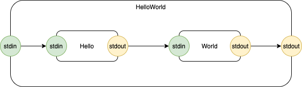

# update Oct. 24, 2022

This diagram:



is transpiled to this JSON:
```
[
  [
    {
      "children": [ {"kind":"Hello", "name":"cell_7"},  {"kind":"World", "name":"cell_8"} ],
      "connections": [
	{
	  "receivers": [ {"receiver": {"component":"cell_7", "port":"stdin"}} ],
	  "senders": [ {"sender": {"component":"cell_6", "port":"stdin"}} ]
	},
	{
	  "receivers": [ {"receiver": {"component":"cell_8", "port":"stdin"}} ],
	  "senders": [ {"sender": {"component":"cell_7", "port":"stdout"}} ]
	},
	{
	  "receivers": [ {"receiver": {"component":"cell_6", "port":"stdout"}} ],
	  "senders": [ {"sender": {"component":"cell_8", "port":"stdout"}} ]
	}
      ],
      "id":"cell_6",
      "inputs": ["cell_17" ],
      "kind":"HelloWorld",
      "name":"HelloWorld",
      "outputs": ["cell_15" ],
      "synccode":""
    }
  ],
  [
    {
      "children": [],
      "connections": [],
      "id":"cell_7",
      "inputs": ["cell_12" ],
      "kind":"Hello",
      "name":"Hello",
      "outputs": ["cell_10" ],
      "synccode":""
    }
  ],
  [
    {
      "children": [],
      "connections": [],
      "id":"cell_8",
      "inputs": ["cell_11" ],
      "kind":"World",
      "name":"World",
      "outputs": ["cell_14" ],
      "synccode":""
    }
  ]
]
```

and the above JSON is transpiled to this Python:
```
from message import Message
from sender import Sender
from selfsender import SelfSender
from receiver import Receiver
from selfreceiver import SelfReceiver
from upconnect import UpConnect
from downconnect import DownConnect
from routeconnect import RouteConnect
from passthroughconnect import PassThroughConnect
from container import Container
from Hello import Hello
from World import World
class HelloWorld (Container): 
  def __init__ (self, parent, name):
    cell_7 = Hello (self, f'{name}-Hello-cell_7');
    cell_8 = World (self, f'{name}-World-cell_8');
    self._children = [cell_7,cell_8]
    self._connections = [
      DownConnect (SelfSender (self,'stdin'), Receiver (cell_7,'stdin')),
      RouteConnect (Sender (cell_7,'stdout'), Receiver (cell_8,'stdin')),
      UpConnect (Sender (cell_8,'stdout'), SelfReceiver (self,'stdout'))
      ]
    super ().__init__ (parent, name, self._children, self._connections)
```

and is transpiled to Common Lisp
```
(in-package "EH")
(defun new-HelloWorld (parent name)
  (let ((self (make-instance 'Container :parent parent :name name)))
    (let ((cell_7 (make-instance 'Hello :parent self :name (format nil "~a-~a-~a" name "Hello" "cell_7"))))
      (let ((cell_8 (make-instance 'World :parent self :name (format nil "~a-~a-~a" name "World" "cell_8"))))
	(let ((children (list cell_7 cell_8 )))
	  (let ((connections (list  
			      (make-instance 'DownConnect :sender (make-instance 'SelfSender :component self :port "stdin") :receiver (make-instance 'Receiver :component cell_7 :port "stdin")) 
			      (make-instance 'RouteConnect :sender (make-instance 'Sender :component cell_7 :port "stdout") :receiver (make-instance 'Receiver :component cell_8 :port "stdin")) 
			      (make-instance 'UpConnect :sender (make-instance 'Sender :component cell_8 :port "stdout") :receiver (make-instance 'SelfReceiver :component self :port "stdout"))  )))
	    (setf (children self) children)
	    (setf (connections self) connections)
	    self))
	))))
```


# Wart
Branch master has a wart - a hard-coded path (see README.md).  This will be fixed in branch dev.

# Next Steps

Cleave ė into multiple parts
- diagram to JSON component descriptors
- JSON component descriptors to Python
- JSON component descriptors to Common Lisp

Create [spin-off](https://github.com/guitarvydas/py0d) which enables manual creation of ė and HSM and 0D code in Python.

# ė - Goal and Overview

The goal of this project is to program computers using pluggable units of software.

To do this we need:
- micro-concurrency
- 0D
- layers, relative sofware units
- multiple languages.

## Hello World 
Very simple example
## Leaf


## Container


## Re-Architecting


# Benefits
- technical drawings come "for free"
- concurrency comes "for free"
- "build and forget" development
- distributed programming comes "for free"
- multiple-CPU paradigm
- ability to plug together software components to create mimimal set of functionality, instead of using an all-in-one behemoth operating system

further discussion...[[Eh - Benefits]]

^
# Key Insights
- 0D - No Dependencies 
- FIFOs and LIFOs
- Pipelines
- Structured Message Passing
- "First Principles Thinking"
- Closures
- "Parallelism" is more than one thing
- Scalability
	- Pluggability is necessary for scalability, but, more elaborate (complicated) examples would be needed to show this off.

# Approach

## Formulate questions
Questions such as...
- Why do hardware designs tend to work while software designs fail and become more complicated?
- Pipelines are different from functions.  How are pipelines different? 
- Message passing.  Is message-passing possible in the synchronous paradigm?
- Message passing - asynchronous - has a bad rep because it is often ad-hoc.  Is there an equivalent to "structured programming" for async message-passing?
- Closures - are closures the same as "processes" in operating systems? 
- DaS - Diagrams as Syntax.  Why are most programming languages textual?
- Tells - what is currently considered difficult?  Multitasking, async, callbacks, mutation, sequencing, history, state ... Can these be improved?  Are they difficult because they're difficult or because our notation makes them difficult?
- Is "something" the same across all programming languages?
- What is parallelism?
- Operating Systems and Programming Languages were invented in the 1950's under the single-cpu assumption.  Is the single-cpu assumption still valid?
- Are end-users forced to use the "same" operating systems / computer environments as developers?

- Can the goal (pluggable components) be sub-divided into smaller sub-goals?
	- Which properties must components have to be pluggable?
	- Which properties inhibit pluggability?


## Synthesize
- upon answering the above questions, it is possible to synthesize a new programming environment?

(The most recent documentation is in Obsidian format](https://publish.obsidian.md/programmingsimplicity/2022-08-21-Eh+Pluggable+Software+Components))


# Install
modify the hard-coded path in lisp/load.lisp (this will soon be changed to be less hard-coded)

  (let ((root "/media/psf/local-projects/eh/lisp"))

then, run make
> make

then, load _eh.html_ into a browser and click the "Generate ..." button

## Diagram
The diagram is _test5.drawio_.

To modify the diagram and re-transpile, run _make_, then copy/paste test5.json into the string `const jsonsrc = String.raw` in _eh.html_.  Then, re-load _eh.html_ and click the "Generate ..." button.
